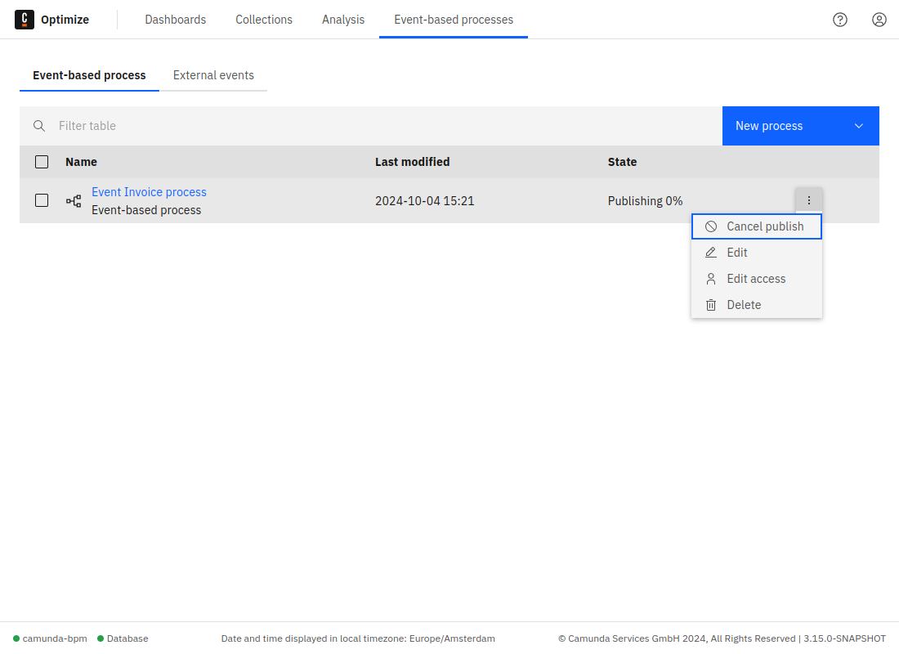
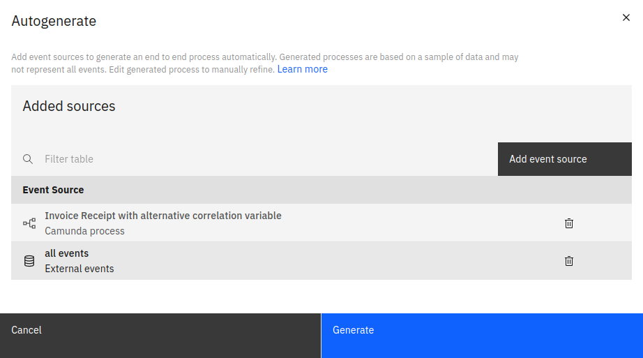
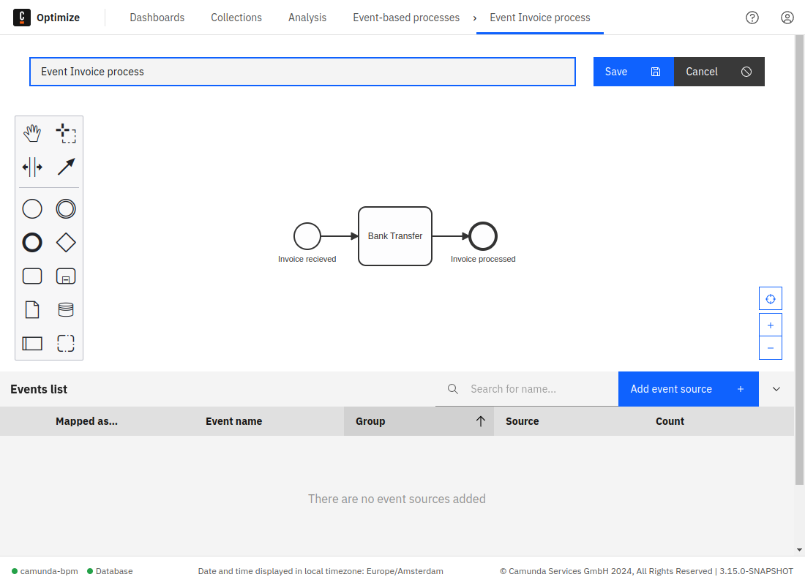
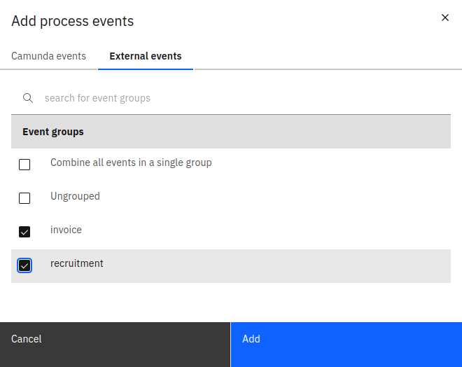
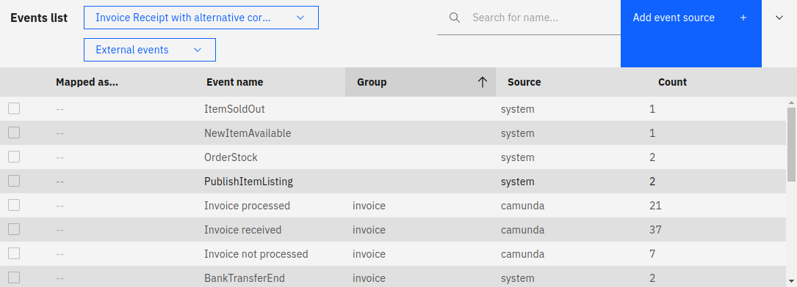
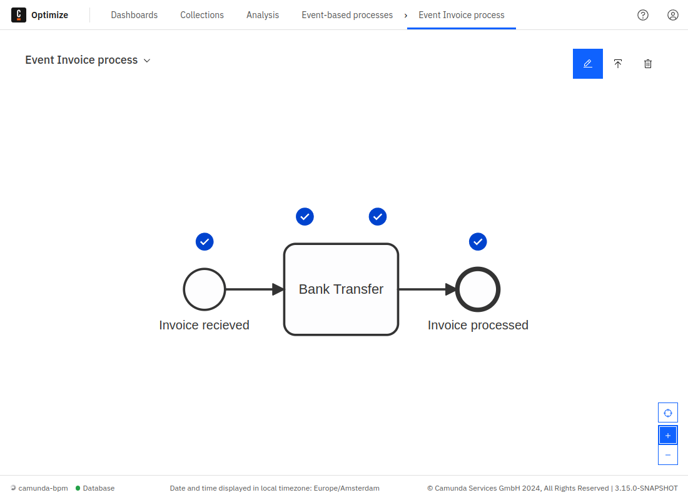
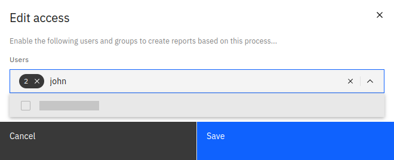
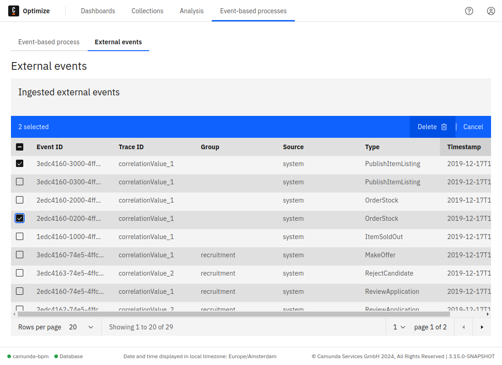

Camunda 7 only

## Overview

Event-based processes are BPMN processes that can be created inside Optimize and based on events. These events can be loaded from an external system or created from internal BPMN processes. They are particularly useful to create reports and dashboards based on a process that is not fully automated with Camunda 7 yet.

Once the event-based process feature is correctly configured, you will see a new link in the navigation to go to the event-based process list. From there, you can see, create, or edit your event-based processes.

:::note
When Camunda activity events are used in event-based processes, Camunda admin authorizations are not inherited for the event-based process. The authorization to use an event-based process is solely managed via the access management of event-based processes when [publishing an event-based process](#publishing-an-event-based-process) or at any time via the [edit access option](#event-based-process-list---edit-access) in the event-based process list.

Visit our [technical guide](/self-managed/optimize-deployment/configuration/setup-event-based-processes.md) on authorization management and event-based processes for the reasoning behind this behavior.
:::

## Set up

You need to set up the event-based processes feature to make use of this feature. See the [technical guide](/self-managed/optimize-deployment/configuration/setup-event-based-processes.md) for more information.

## Event-based process list

All currently available event-based processes are listed under the main navigation item **Event-based processes**. From there, it is possible to see their state, which can be one of the following:

- `Unmapped` - The process model is created, but no single event is mapped to a flow node.
- `Mapped` - The process model contains at least one mapping of an event to a flow node.
- `Published` - The event-based process is published and can be used in reports by users that are authorized to access it.
- `Unpublished Changes` - The process model contains changes that are not reflected in the currently published state of the event-based process; it needs to get republished manually.

### Event-based process list - edit access

To manage authorizations for a published event-based process, the **Edit Access** option in the dropdown menu of each event-based process list entry allows you to authorize users or groups to create reports for these processes in Optimize.

## Creating an event-based process

There are three ways to create an event-based process:

### Auto-generate

:::note
The process auto-generation feature is currently in early beta stage.
:::

The first way to create an event-based process is to allow Optimize to auto-generate the model based on provided configuration. Using this option, you can specify which event sources should be used for the process, including both Camunda and external events.

Note that for external events, it is currently only possible to select all the external events.

Optimize will attempt to generate an overall model based on these sources, determining the order of events in the model by sampling stored instances. After auto-generation is complete, you will see the process in [view mode](#view-mode), with the model's nodes fully mapped to their corresponding events.

To make changes to the autogenerated process, modify either the model itself, the process name, or the process mappings in the same way as any other event-based process by entering [edit mode](#edit-mode).

### Model a process

The second way to create an event-based process is to model it manually using the integrated BPMN modeler.

### Upload BPMN model

Finally, you can create an event-based process by uploading a `.bpmn` file directly into Optimize.

## Edit mode

The edit mode allows you to build and map your event-based process. Using this mode, you can perform all kinds of operations, such as:

- Rename the process.
- Model the process using the integrated BPMN modeler.
- Map your diagram nodes to an event from the event table.
- Edit event sources for the events to display in the event table.
- Save the current state with your applied changes.
- Cancel changes you already applied to the process.

### Modeling

Modeling can be done using the integrated modeler shown in the screenshot above. To maximize the modeling area, collapse the table during the modeling by clicking on the **Collapse** button in the top right of the table.

### Event sources

To map BPMN nodes to events, add event sources to the process first by clicking the **Add Event Sources** button available at the top of the table.

In this view, it is possible to add two types of events to the events list:

#### External events

Events that were ingested into Optimize from an external system. These events can be imported into Optimize using the event ingestion API Optimize provides.

Defining the `group` property when ingesting the events will allow selecting events that belong to a group. If the group property is not defined or left empty during ingestion of an event, Optimize will consider it `ungrouped`.

#### Camunda events

These are events generated from an existing Camunda BPMN process. Only processes for which Optimize has imported at least one event will be visible for selection. This means the process has to have at least one instance and Optimize has to have been configured to import data from that process.

See the [technical guide](/self-managed/optimize-deployment/configuration/setup-event-based-processes.md#use-camunda-activity-event-sources-for-event-based-processes) for more information on how this is configured.

To add such events, provide the following details:

- The target process definition that you would like to generate the events from

- The trace ID location: A trace ID uniquely identifies a process instance across system boundaries. One example would be an invoice number for an invoice handling process. For a Camunda process, it is possible to select a trace ID that exists either in a variable or in the process business key.

- Which events to display in the table:

Adding events for every flow node might not be necessary for the event-based process. Therefore, we provide the ability to only add the events that are necessary. There are three options available:

- Process start and end: This will add only two events in the table, one event is triggered when the process starts and one when it ends.

- Start and end flow node events: The number of events added to the table will depend on how many start and end events are in the process. For example, if there is one start event and two end events, three events will be added.

- Start and end flow node events: This option will add events for every flow node in the process.

Once this information is defined and the sources are added, the events will appear in the table as shown below.

#### Events table

Each event in the table will have the following properties:

- Mapped as (start/end): Defines whether the event indicates start of BPMN node or the end of it.

- Event name

- Group

  - For external events, this corresponds to the group of the ingested event.
  - For Camunda process events, this corresponds to the name of the process definition.

- Source: External system or Camunda process event.

- Count: How many times this event was triggered. See [additional notes](#event-counts) for more information.

To assist during event mapping, the events table offers suggestions of potential events to be mapped based on the selected node. This is indicated by a blue strap near the suggested event. The event suggestion only works when adding all external events as a source with no Camunda events.

### Mapping events

Mapping is the process of linking BPMN flow nodes to events.

To start mapping, take the following steps:

1. Select the node that you would like to map from the diagram.
2. To link the selected node to an event, enable the checkbox of that event from the table. Afterwards, a checkmark sign will be shown on top of the node to indicate that the event has been mapped successfully.

:::note
Not all BPMN nodes can be mapped. Only events and activities can be mapped to events.
:::

Once all the necessary nodes are mapped, you can save your diagram to go the view mode.

## View mode

The view mode gives you a quick overview of which flow nodes have been mapped to events and allows you to enter the edit mode, publish, or delete the current event-based process.

### Publishing an event-based process

Once you have built and mapped your event-based process, you need to publish it to make it available for reports and dashboards. To publish your process, click the **Publish** button in the view mode of your event-based process.

In the shown modal, you can see who will have access to use the event-based process. By default, the process is only available to the user who created it. If you would like to allow other users to use the process in reports, click **Change...** to open the permissions options.

In this modal, it is possible to search for users and groups and add them to the list of users who have access to the process. Once that is done, you can save the changes and publish your process.

Publishing the process will take some time to correlate all events and generate your event-based process. Once the publishing is done, a notification will appear indicating this.

Now the process is ready and can be used like any other process to create reports and dashboards.

## External ingested events

After ingesting events into Optimize from an external system, each individual event will appear in the external events table.

By default, the table shows all ingested events sorted by the timestamp from newest to oldest. However, it is also possible to search for events or sort the results by event name, source, group, or trace ID.

### Deleting ingested events

One or multiple events can be selected and deleted as shown in the figure below:

:::note
When deleting an event mapped to a published event-based process, only the corresponding flow node instance will be removed from the process and no change will happen on the process instance level until the process is republished.

For example, if you delete an ingested event that was mapped to the only end event within a process, the corresponding process instance will still be considered complete until the process is republished.
:::

## Additional notes

### Event-based process auto-generation

Event-based process auto-generation attempts to determine the order of events based on a sample of stored instances. Due to the nature of sampling, it is possible that the generated model may not always appear as you might expect.

In some cases, it is possible that some sequence flows may be hidden by overlapping elements on the generated model.

If both an event source and an embedded subprocess contained within that source are included for auto-generation, they will appear in the auto-generated model as independent processes.

In the case where external events are configured as an event source, it is possible that Optimize will not be able to determine a model containing all external events. In this scenario,
Optimize will auto-generate a model containing only the external events that it could determine the order of.

In any of the above scenarios, you are able to correct the model to suit your needs using the editor. Like any other event-based process, an auto-generated model can be edited so you can make any necessary corrections after auto-generation is complete.

### Published event-based processes

In some scenarios, reports created using event-based processes might not show all the information expected.

To avoid this, we encourage you to avoid including the following elements when modelling your event-based processes:

- Inclusive gateways: These may be modeled in an event-based process diagram. However, visual data flow will be interrupted on reports such as heatmaps.

- Complex gateways: These may be modeled in an event-based process diagram. However, visual data flow will be interrupted on reports such as heatmaps.

- Mixed gateway directions: Mixed gateways are gateways which have no clear direction, instead being a combination of opening and closing gateways. These may be modeled in an event-based process diagram. However, visual data flow will be interrupted on reports such as heatmaps.

- Chained gateways: A chained gateway is one that occurs as part of a sequence of consecutive gateways. These may be modeled in an event-based process diagram. However, visual data flow will be interrupted on reports such as heatmaps.

### Event counts

Event counts in the table may not match the values you expected. There are three possible explanations for this:

- If you have enabled history cleanup, the counts will still include events from process instances that have since been cleaned up.
- For events from Camunda processes, the count value represents the number of times that event has occurred across all versions and tenants of that process, regardless of how the event source is configured.
- The counts for external events will still include ingested events that have since been deleted using the [event inspection feature](#deleting-ingested-events).
