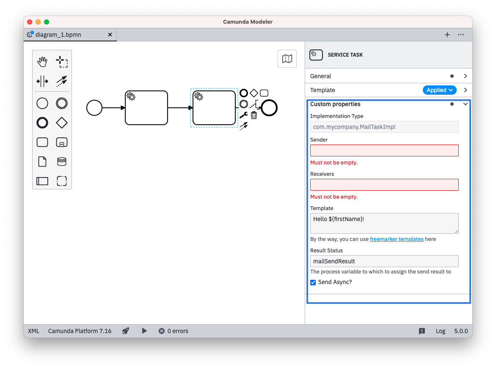
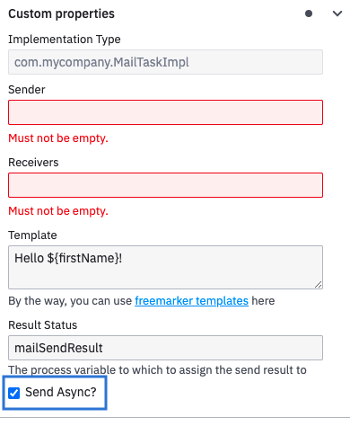
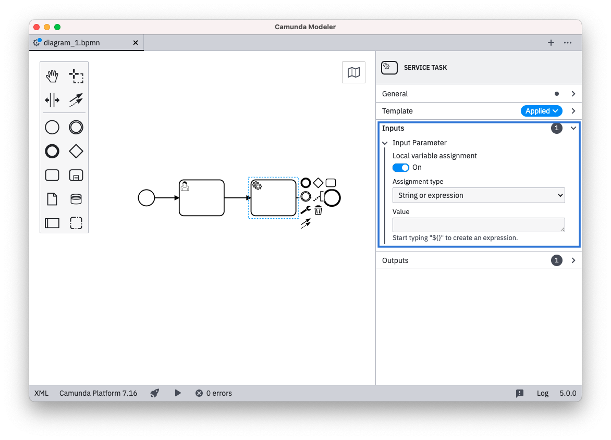
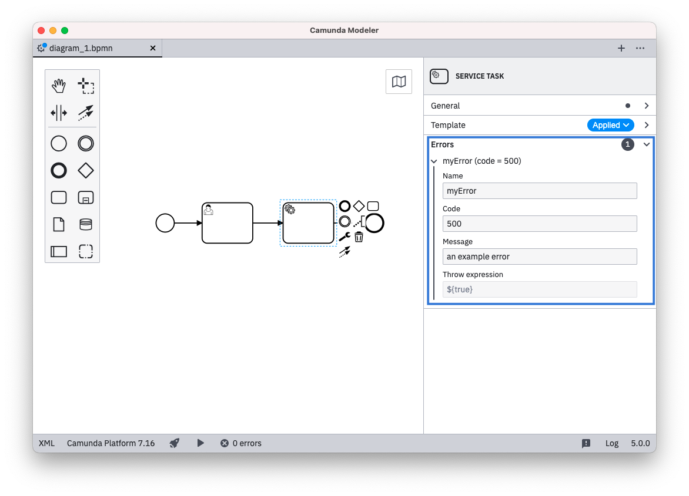

<span class="badge badge--platform">Camunda 7 only</span>

Templates are defined in template descriptor files as a JSON array:

```json
[
  {
    "$schema": "https://unpkg.com/@camunda/element-templates-json-schema/resources/schema.json",
    "name": "Template 1",
    "id": "sometemplate",
    "description": "some description",
    "version": 1,
    "appliesTo": [
      "bpmn:Task"
    ],
    "elementType": {
      "value": "bpmn:ServiceTask",
    },
    "properties": [
      ...
    ]
  },
  {
    "name": "Template 2",
    ...
  }
]
```

As seen in the code snippet, a template consists of a number of important components:

- `$schema : String`: URI pointing towards the [JSON schema](https://json-schema.org/) which defines the structure of the element template `.json` file. Element template schemas are maintained in the [element templates JSON schema](https://github.com/camunda/element-templates-json-schema) repository. Following the [JSON schema](https://json-schema.org/) standard, you may use them for validation or to get assistance (e.g., auto-completion) when working with them in your favorite IDE.

  Example:

  ```json
  "$schema": "https://unpkg.com/@camunda/element-templates-json-schema/resources/schema.json"
  ```

- `name : String`: Name of the template. Shown in the element template selection modal and in the properties panel (after applying an element template).
- `id : String`: ID of the template.
- `description : String`: Optional description of the template. Shown in the element template selection modal and in the properties panel (after applying an element template).
- `documentationRef : String`: Optional URL pointing to a template documentation. Shown in the properties panel (after applying an element template).
- `version : Integer`: Optional version of the template. If you add a version to a template it will be considered unique based on its ID and version. Two templates can have the same ID if their version is different.
- `appliesTo : Array<String>`: List of BPMN types the template can be applied to.
- `elementType : Object`: Optional type of the element. If you configure `elementType` on a template, the element is replaced with the specified type when a user applies the template.
- `properties : Array<Object>`: List of properties of the template.

## JSON schema compatibility

The application uses the `$schema` property to ensure compatibility for a given element template. Find the latest supported version [here](https://www.npmjs.com/package/@camunda/element-templates-json-schema).

The tooling ignores element templates defining a higher `$schema` version and logs a warning message.

For example, given the following `$schema` definition, the application takes `0.9.1` as the JSON Schema version of the element template:

```json
"$schema": "https://unpkg.com/@camunda/element-templates-json-schema@0.9.1/resources/schema.json"
```

The JSON schema versioning is backward-compatible, meaning all versions including or below the current one are supported. In case no `$schema` is defined, Camunda Modeler assumes the latest JSON schema version for Camunda 7 element templates.

## Supported BPMN types

Currently, element templates may be used on the following BPMN elements:

- `bpmn:Activity` (including tasks, service tasks, and others)
- `bpmn:SequenceFlow` (for maintaining `condition`)
- `bpmn:Process`
- `bpmn:Event`

## Defining template properties

With each template, you define some user-editable fields, their mapping to BPMN 2.0 XML, and Camunda extension elements.

Let us consider the following example that defines a template for a mail sending task:

```json
{
  "$schema": "https://unpkg.com/@camunda/element-templates-json-schema/resources/schema.json",
  "name": "Mail Task",
  "id": "com.camunda.example.MailTask",
  "appliesTo": ["bpmn:ServiceTask"],
  "properties": [
    {
      "label": "Implementation Type",
      "type": "String",
      "value": "com.mycompany.MailTaskImpl",
      "editable": false,
      "binding": {
        "type": "property",
        "name": "camunda:class"
      }
    },
    {
      "label": "Sender",
      "type": "String",
      "binding": {
        "type": "camunda:inputParameter",
        "name": "sender"
      },
      "constraints": {
        "notEmpty": true
      }
    },
    {
      "label": "Receivers",
      "type": "String",
      "binding": {
        "type": "camunda:inputParameter",
        "name": "receivers"
      },
      "constraints": {
        "notEmpty": true
      }
    },
    {
      "label": "Template",
      "description": "By the way, you can use freemarker templates ${...} here",
      "value": "Hello ${firstName}!",
      "type": "Text",
      "binding": {
        "type": "camunda:inputParameter",
        "name": "messageBody",
        "scriptFormat": "freemarker"
      },
      "constraints": {
        "notEmpty": true
      }
    },
    {
      "label": "Result Status",
      "description": "The process variable to which to assign the send result to",
      "type": "String",
      "value": "mailSendResult",
      "binding": {
        "type": "camunda:outputParameter",
        "source": "${ resultStatus }"
      }
    },
    {
      "label": "Async before?",
      "type": "Boolean",
      "binding": {
        "type": "property",
        "name": "camunda:asyncBefore"
      }
    }
  ]
}
```

The example defines five custom fields, each mapped to different technical properties:

- _Implementation Type_ is mapped to the `camunda:class` property in BPMN 2.0 XML.
- _Sender_, _Receivers_, and _Template_ properties are mapped to `input parameters`.
- _Result Status_ is mapped back from the Java Delegate into a process variable via an `output parameter`.

All but the _Implementation Type_ are editable by the user through the properties panel as shown in the following screenshot:



As seen in the example, the important attributes in a property definition are:

- `label`: A descriptive text shown with the property.
- `type`: Defining the visual appearance in the properties panel (may be any of `String`, `Text`, `Boolean`, `Dropdown`, or `Hidden`).
- `value`: An optional default value to be used if the property to be bound is not yet set.
- `binding`: Specifying how the property is mapped to BPMN or Camunda extensions (cf. [bindings](#bindings)).
- `constraints`: A list of editing constraints to apply to the template.

### Types

The input types `String`, `Text`, `Boolean`, `Dropdown`, and `Hidden` are available. As seen above, `String` maps to a single-line input, while `Text` maps to a multi-line input.

#### Boolean/checkbox type

The `Boolean` type maps to a checkbox that can be toggled by the user. It renders as shown below:



When checked, it maps to `true` in the respective field (refer to [bindings](#bindings)). Note that it does not map to `${true}` and can therefore not be used e.g., for mapping a boolean to a process variable.

#### Dropdown type

The `Dropdown` type allows users to select from a number of pre-defined options that are stored in a custom properties `choices` attribute as `{ name, value }` pairs:

```json
...
  "properties": [
    ...
    {
      "label": "Task Priority",
      "type": "Dropdown",
      "value": "50",
      "choices": [
        { "name": "low", "value": "20" },
        { "name": "medium", "value": "50" },
        { "name": "height", "value": "100" }
      ]
    }
  ]
...
```

The resulting properties panel control looks like this:


#### Omitted type

:::note
Omitting the type is supported in Camunda 7 element templates only.
:::

By omitting the `type` configuration, the default UI component is rendered for the respective binding.

For `camunda:inputParameter` and `camunda:outputParameter` bindings an input/output parameter mapping component is rendered. The component includes a toggle to enable or disable the `Variable Assignment`. When untoggling, the respective `camunda:inputParameter` or `camunda:outputParameter` element will not be created in the BPMN XML.



:::note
The configuration options `editable` and `constraints` have no effect for the `camunda:inputParameter` and `camunda:outputParameter` default component.
:::

For `camunda:errorEventDefinition` bindings, an error component is rendered. The component will include all properties of the referenced `bpmn:Error` element.



:::note
The configuration options `editable` and `constraints` have no effect for the `camunda:errorEventDefinition` default component.
:::

For the `property`, `camunda:property`, `camunda:in`, `camunda:in:businessKey`, `camunda:out`, and `camunda:field` bindings, an omitted `type` renders the `String` component (single line input).

For the `camunda:executionListener` binding, an omitted `type` leads to the `Hidden` component (ie. no visible input for the user).

### Bindings

The following ways exist to map a custom field to the underlying BPMN 2.0 XML. The _"mapping result"_ in the following section will use `[userInput]` to indicate where the input provided by the user in the `Properties Panel` is set in the BPMN XML. As default or if no user input was given, the value specified in `value` is displayed and used for `[userInput]`. `[]` brackets are used to indicate where the parameters are mapped to in the XML.

Notice that adherence to the following configuration options is enforced by design. If not adhering, it logs a validation error and ignores the respective element template.

#### `property`

| **Binding `type`**          | `property`                       |
| --------------------------- | -------------------------------- |
| **Valid property `type`'s** | All property types are supported |
| **Binding parameters**      | `name`: the name of the property |
| **Mapping result**          | `<... [name]=[userInput] ... />` |

#### `camunda:property`

| **Binding `type`**          | `camunda:property`                                       |
| --------------------------- | -------------------------------------------------------- |
| **Valid property `type`'s** | `String`<br />`Hidden`<br />`Dropdown`                   |
| **Binding parameters**      | `name`: The name of the extension element property       |
| **Mapping result**          | `<camunda:property name="[name]" value="[userInput]" />` |

#### `camunda:inputParameter`

| **Binding `type`**          | `camunda:inputParameter`                                                                                                                                                                                                                                                                              |
| --------------------------- | ----------------------------------------------------------------------------------------------------------------------------------------------------------------------------------------------------------------------------------------------------------------------------------------------------- |
| **Valid property `type`'s** | `String`<br /> `Text`<br />`Hidden`<br />`Dropdown`                                                                                                                                                                                                                                                   |
| **Binding parameters**      | `name`: The name of the input parameter<br />`scriptFormat`: the format of the script (if script is to be mapped)                                                                                                                                                                                     |
| **Mapping result**          | If `scriptFormat` is not set:<br />`<camunda:inputParameter name="[name]">[userInput]</camunda:inputParameter>`<br /><br />If `scriptFormat` is set:<br />`<camunda:inputParameter name="[name]"><camunda:script scriptFormat="[scriptFormat]">[userInput]</camunda:script></camunda:inputParameter>` |

#### `camunda:outputParameter`

| **Binding `type`**           | `camunda:outputParameter`                                                                                                                                                                                                                                                                                    |
| ---------------------------- | ------------------------------------------------------------------------------------------------------------------------------------------------------------------------------------------------------------------------------------------------------------------------------------------------------------ |
| **Valid property `type`'s**  | `String`<br />`Hidden`<br />`Dropdown`                                                                                                                                                                                                                                                                       |
| **Binding parameters**       | `source`: The source value to be mapped to the `outputParameter`<br />`scriptFormat`: the format of the script (if script is to be mapped)                                                                                                                                                                   |
| **Mapping result (example)** | If `scriptFormat` is not set:<br />`<camunda:outputParameter name="[userInput]">[source]</camunda:inputParameter>`<br /><br />If `scriptFormat` is set:<br />`<camunda:outputParameter name="[userInput]"><camunda:script scriptFormat="[scriptFormat]">[source]</camunda:script></camunda:outputParameter>` |

#### `camunda:in`

| **Binding `type`**          | `camunda:in`                                                                                                                                                                                                                                                                                                                                                                                                                                                                                                                                                                                                                                                                                                                                                                                                                                                                                                                    |
| --------------------------- | ------------------------------------------------------------------------------------------------------------------------------------------------------------------------------------------------------------------------------------------------------------------------------------------------------------------------------------------------------------------------------------------------------------------------------------------------------------------------------------------------------------------------------------------------------------------------------------------------------------------------------------------------------------------------------------------------------------------------------------------------------------------------------------------------------------------------------------------------------------------------------------------------------------------------------- |
| **Valid property `type`'s** | `String`<br />`Hidden`<br />`Dropdown`                                                                                                                                                                                                                                                                                                                                                                                                                                                                                                                                                                                                                                                                                                                                                                                                                                                                                          |
| **Binding parameters**      | `target`: the target value to be mapped to<br />`expression`: `true` indicates that the userInput is an expression<br />`variables`: either `all` or `local` indicating the variable mapping                                                                                                                                                                                                                                                                                                                                                                                                                                                                                                                                                                                                                                                                                                                                    |
| **Mapping result**          | If `target` is set:<br />`<camunda:in source="[userInput]" target="[target]"/>`<br /><br />If `target` is set and `expression` is set to `true`:<br />`<camunda:in sourceExpression="[userInput]" target="[target]" />`<br /><br /> If `variables` is set to `local`:<br />` <camunda:in local="true" variables="all" />` (Notice there is no `[userInput]`, therefore has to use property `type` of value `Hidden`)<br /><br />If `variables` is set to `local` and `target` is set:<br />`<camunda:in local="true" source="[userInput]" target="[target]" />`<br /><br />If `variables` is set to `local`, `target` is set and `expression` is set to `true`:<br />`<camunda:in local="true" sourceExpression="[userInput]" target="[target]" />`<br /><br />If `variables` is set to `all`:<br />`<camunda:in variables="all" />` (Notice there is no `[userInput]`, therefore has to use property `type` of value `Hidden`) |

#### `camunda:in:businessKey`

| **Binding `type`**          | `camunda:in:businessKey`                   |
| --------------------------- | ------------------------------------------ |
| **Valid property `type`'s** | `String`<br />`Hidden`<br />`Dropdown`     |
| **Binding parameters**      |                                            |
| **Mapping result**          | `<camunda:in businessKey="[userInput]" />` |

#### `camunda:out`

| **Binding `type`**          | `camunda:out`                                                                                                                                                                                                                                                                                                                                                                                                                                                                                                                                                                                                                                                                                                                                                                                                                                                                                     |
| --------------------------- | ------------------------------------------------------------------------------------------------------------------------------------------------------------------------------------------------------------------------------------------------------------------------------------------------------------------------------------------------------------------------------------------------------------------------------------------------------------------------------------------------------------------------------------------------------------------------------------------------------------------------------------------------------------------------------------------------------------------------------------------------------------------------------------------------------------------------------------------------------------------------------------------------- |
| **Valid property `type`'s** | `String`<br />`Hidden`<br />`Dropdown`                                                                                                                                                                                                                                                                                                                                                                                                                                                                                                                                                                                                                                                                                                                                                                                                                                                            |
| **Binding parameters**      | `source`: the source value to be mapped<br />`sourceExpression`: a string containing the expression for the source attribute<br />`variables`: either `all` or `local` indicating the variable mapping                                                                                                                                                                                                                                                                                                                                                                                                                                                                                                                                                                                                                                                                                            |
| **Mapping result**          | If `source` is set:<br />`<camunda:out source="[source]" target="[userInput]" />`<br /><br />If `sourceExpression` is set:<br />`<camunda:out sourceExpression="[sourceExpression]" target="[userInput]" />`<br /><br />If `variables` is set to `all`:<br />`<camunda:out variables="all" />` (Notice there is no `[userInput]`, therefore has to use property `type` of value `Hidden`)<br /><br />If `variables` is set to `local` and `source` is set:<br />`<camunda:out local="true" source="[source]" target="[userInput]" />`<br /><br />If `variables` is set to `local` and `sourceExpression` is set:<br />`<camunda:out local="true" sourceExpression="[source]" target="[userInput]" />`<br /><br />If `variables` is set to `local`:<br />`<camunda:out local="true" variables="all" />` (Notice there is no `[userInput]`, therefore has to use property `type` of value `Hidden`) |

#### `camunda:executionListener`

| **Binding `type`**          | `camunda:executionListener`                                                                                                                                                                                                                                                                                                                                                                                                                          |
| --------------------------- | ---------------------------------------------------------------------------------------------------------------------------------------------------------------------------------------------------------------------------------------------------------------------------------------------------------------------------------------------------------------------------------------------------------------------------------------------------- |
| **Valid property `type`'s** | `Hidden`                                                                                                                                                                                                                                                                                                                                                                                                                                             |
| **Binding parameters**      | `event`: Value for the `event` attribute<br />`implementationType`: the type of implementation, one of `script`, `class`, `expression` or `delegateExpression`<br />`scriptFormat`: the format of the script (required if `implementationType` is `script`)                                                                                                                                                                                          |
| **Mapping result**          | If `scriptFormat` is not set:<br />`<camunda:executionListener event="[event]" [implementationType]="[value]" />`<br /><br />If `scriptFormat` is set:<br />`<camunda:executionListener event="[event]"><camunda:script scriptFormat="[scriptFormat]">[value]</camunda:script></camunda:executionListener>`<br /><br />(Notice that `[value]` needs to be set, since only `Hidden` is allowed as a type hence the user can not set a `[userInput]`). |

#### `camunda:field`

| **Binding `type`**          | `camunda:field`                                                                                                                                                                                                                   |
| --------------------------- | --------------------------------------------------------------------------------------------------------------------------------------------------------------------------------------------------------------------------------- |
| **Valid property `type`'s** | `String`<br /> `Text`<br />`Hidden`<br />`Dropdown`                                                                                                                                                                               |
| **Binding parameters**      | `name`: Value for the `name` attribute<br />`expression`: `true` that an expression is passed                                                                                                                                     |
| **Mapping result**          | `<camunda:field name="[name]"><camunda:string>[userInput]</camunda:string></camunda:field>`<br /><br />If `expression` is set to `true`:<br />`<camunda:field name="[name]"><camunda:expression>[userInput]</camunda:expression>` |

#### `camunda:errorEventDefinition`

| **Binding `type`**          | `camunda:errorEventDefinition`                                                                                                                                                                                                                       |
| --------------------------- | ---------------------------------------------------------------------------------------------------------------------------------------------------------------------------------------------------------------------------------------------------- |
| **Valid property `type`'s** | `String`<br />`Hidden`<br />`Dropdown`                                                                                                                                                                                                               |
| **Binding parameters**      | `errorRef`: Reference to a scoped `bpmn:Error` binding, generates the `errorRef` attribute as unique id. <br />                                                                                                                                      |
| **Mapping result**          | `<camunda:errorEventDefinition id="[unique element id]" expression="[userInput]" errorRef="Error_[errorRef]_[unique suffix]" />` <br /><br /> For the referenced scoped `bpmn:Error` binding: `<bpmn:Error id="Error_[errorRef]_[unique suffix]" />` |

### Scoped bindings

Scoped bindings allow you to configure nested elements, such as [Camunda 7 Connectors](https://docs.camunda.org/manual/latest/user-guide/process-engine/connectors/#use-connectors).

```json
{
  "name": "ConnectorGetTask",
  "id": "my.connector.http.get.Task",
  "appliesTo": [
    "bpmn:Task"
  ],
  "properties": [],
  "scopes": [
    {
      "type": "camunda:Connector",
      "properties": [
        {
          "label": "ConnectorId",
          "type": "String",
          "value": "My Connector HTTP - GET",
          "binding": {
            "type": "property",
            "name": "connectorId"
          }
        },
        ...
      ]
    }
  ]
}
```

The example shows how a Connector is configured as part of the task.
On task creation, the Connector is created with it and the Connector bindings are
exposed to the user in a separate custom fields section.


#### Supported scopes

Camunda 7 supports the following scope bindings:

| Name                | Target                                                                                     |
| ------------------- | ------------------------------------------------------------------------------------------ |
| `camunda:Connector` | [Connectors](https://docs.camunda.org/manual/latest/user-guide/process-engine/connectors/) |
| `bpmn:Error`        | Global BPMN Error Element                                                                  |

### Groups

You may define `groups` to organize custom fields into:

```json
{
  "$schema": "https://unpkg.com/@camunda/zeebe-element-templates-json-schema/resources/schema.json",
  "name": "Groups",
  "id": "group-example",
  "appliesTo": [
    "bpmn:ServiceTask"
  ],
  "groups": [
    {
      "id": "definition",
      "label": "Task definition"
    },
    {
      "id": "request",
      "label": "Request payload"
    },
    {
      "id": "result",
      "label": "Result mapping"
    }
  ],
  "properties": [
    ...
  ]
}
```

Associate a field with a group (ID) via the fields `group` key:

```json
{
  ...
  "properties": [
    {
      "label": "Implementation Type",
      "type": "String",
      "group": "definition",
      "binding": {
        "type": "property",
        "name": "camunda:class"
      }
    },
    ...
  ],
  ...
}
```


### Constraints

Custom fields may have a number of constraints associated with them:

- `notEmpty`: Input must be non-empty
- `minLength`: Minimal length for the input
- `maxLength`: Maximal length for the input
- `pattern`: Regular expression to match the input against

#### Regular expression

Together with the `pattern` constraint, you may define your custom error messages:

```json
...
  "properties": [
    {
      "label": "Web service URL",
      "type": "String",
      "binding": { ... },
      "constraints": {
        "notEmpty": true,
        "pattern": {
          "value": "https://.*",
          "message": "Must be https URL"
        }
      }
    }
  ]
```

### Placeholder

The following property types support the `placeholder` attribute:

- `String`
- `Text`

The attribute is supported for the following binding types:

- `property`
- `camunda:property`
- `camunda:in`
- `camunda:in:businessKey`
- `camunda:out`
- `camunda:field`

The placeholder is displayed when a field is empty:

```json
...
  "properties": [
    {
      "label": "Web service URL",
      "type": "String",
      "binding": { ... },
      "placeholder": "https://example.com"
    }
  ]
```

### Display all entries

Per default, the element template defines the visible entries of the properties panel. All other property controls are hidden. If you want to bring all the default entries back, it is possible to use the `entriesVisible` property.

```json
[
  {
    "name": "Template 1",
    "id": "sometemplate",
    "entriesVisible": true,
    "appliesTo": [
      "bpmn:ServiceTask"
    ],
    "properties": [
      ...
    ]
  }
]
```


