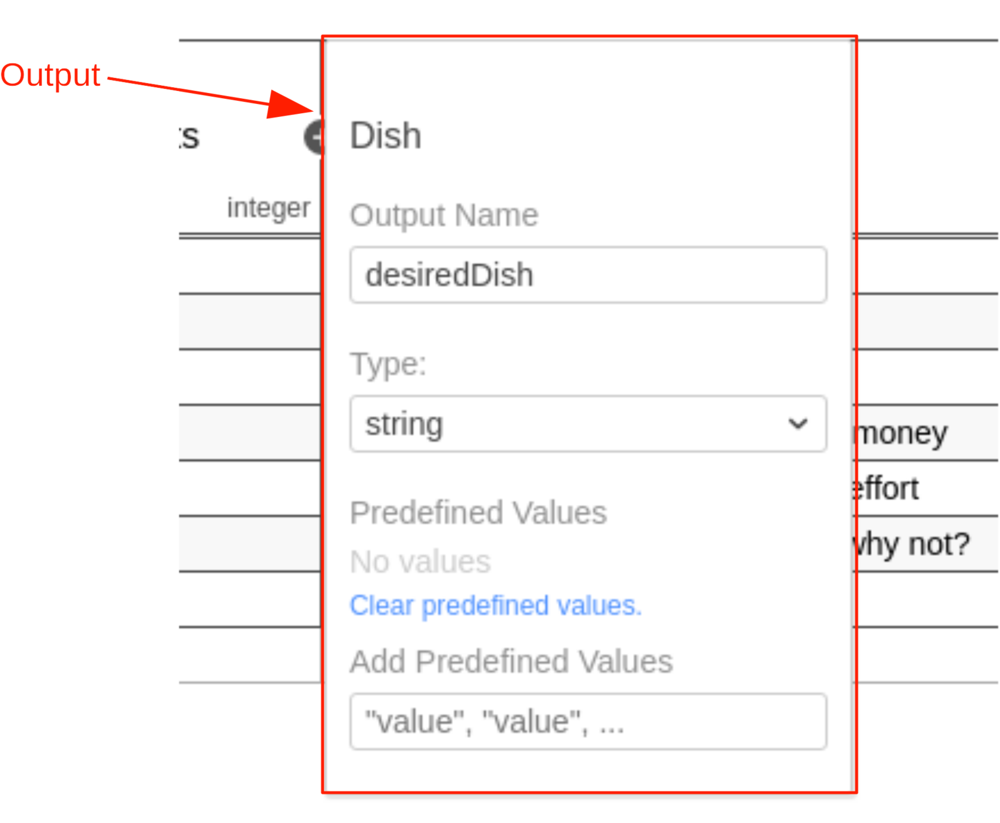
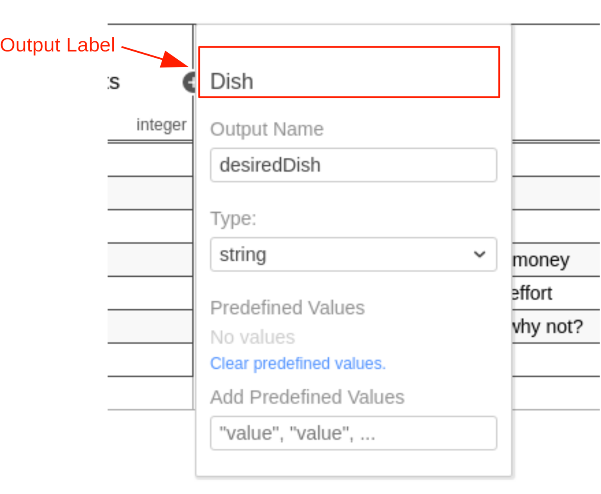
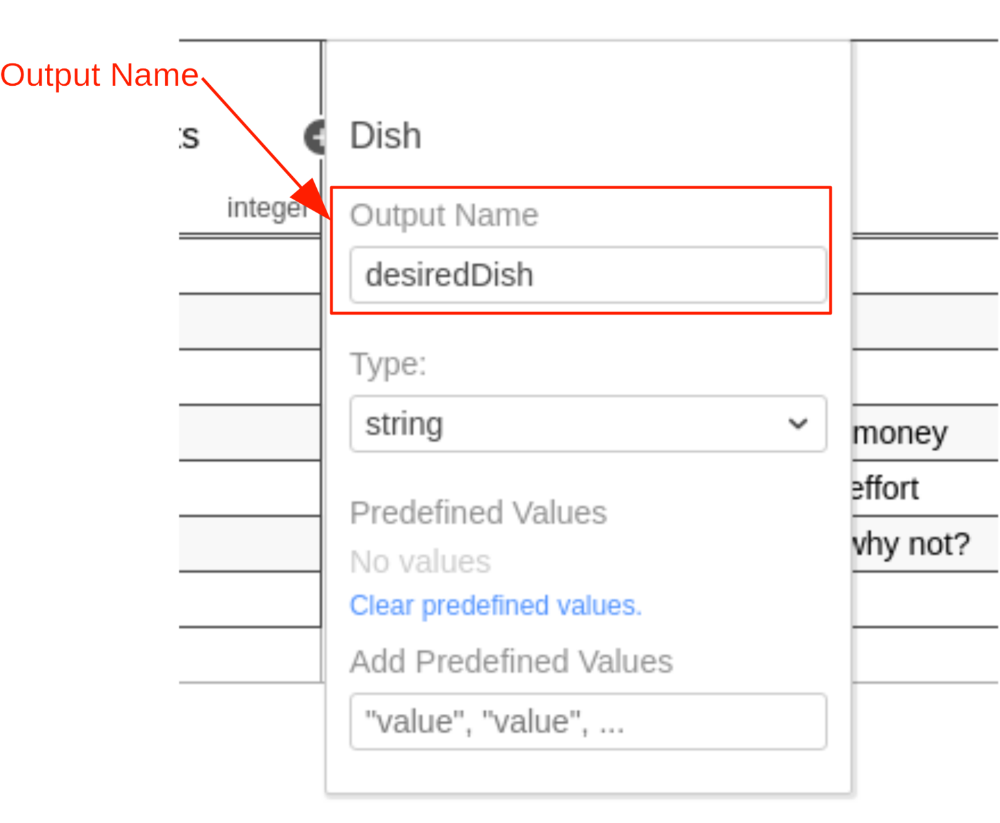
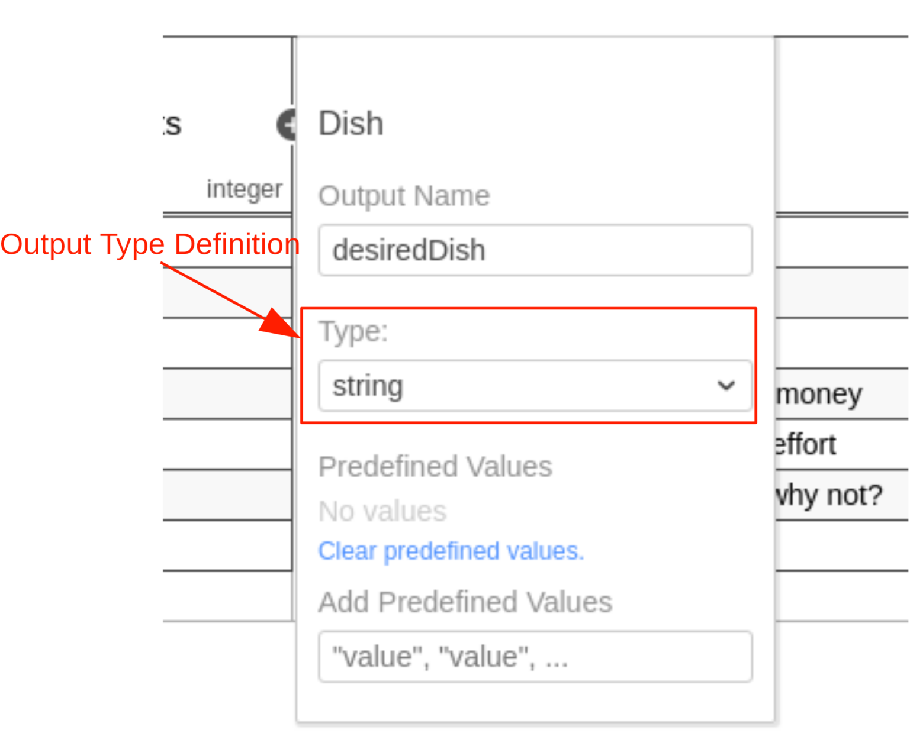

A decision table can have one or more outputs, also called output clauses. An output clause defines the id, label, name
and type of a decision table output.

An output clause is represented by an `output` element inside a `decisionTable`
XML element.

```xml

<definitions xmlns="https://www.omg.org/spec/DMN/20191111/MODEL/" id="definitions" name="definitions"
             namespace="http://camunda.org/schema/1.0/dmn">
    <decision id="dish" name="Dish">
        <decisionTable id="decisionTable">
            <!-- ... -->
            <output id="output1" label="Dish" name="desiredDish" typeRef="string"/>
            <!-- ... -->
        </decisionTable>
    </decision>
</definitions>

```

## Output id

The output id is a unique identifier of the decision table output. It is used by Camunda to reference the
output clause. Therefore, it is required. It is set as the `id` attribute of the `output` XML element.

```xml

<output id="output1" label="Dish" name="desiredDish" typeRef="string"/>
```

## Output label



An output label is a short description of the output. It is set on the `output`
XML element in the `label` attribute. Note that the label is not required but recommended, since it helps to understand
the decision.

```xml

<output id="output1" label="Dish" name="desiredDish" typeRef="string"/>
```

## Output name



The name of the output is used to reference the value of the output.

It is specified by the `name` attribute on the `output` XML element.

If the decision table has more than one output, then all outputs must have a unique name.

:::caution

The output name may not contain any special characters or symbols (e.g. whitespace, dashes, etc.).

The output name can be any alphanumeric string including the `_` symbol. For a combination of words, it's recommended to
use the `camelCase` or the `snake_case` format. The `kebab-case` format is not allowed because it contains the
operator `-`.

If the output name contain a special character or symbol then the output can't be accessed in
a [dependent decision](decision-requirements-graph.md#required-decisions) nor in a calling BPMN process.

:::

:::tip

If the decision table has only one output then it is recommended that the [decision id](decision-table.md#decision-id)
is used as the output name.

The decision result can be accessed in a [dependent decision](decision-requirements-graph.md#required-decisions) by its
decision id. Only if the decision table has more than one output then the output values are grouped under the decision
id and can be accessed by their output names ( e.g. `decisionId.outputName`).

:::

```xml

<output id="output1" label="Dish" name="desiredDish" typeRef="string"/>
```

## Output type definition



The type of the output clause can be specified by the `typeRef` attribute on the
`output` XML element.

After an output entry is evaluated, it checks if the result converts to the specified type. The type should be one of
the supported [data types](dmn-data-types.md).

```xml

<output id="output1" label="Dish" name="desiredDish" typeRef="string"/>
```

Note that the type is not required but recommended, since it provides a type safety of the output values.
